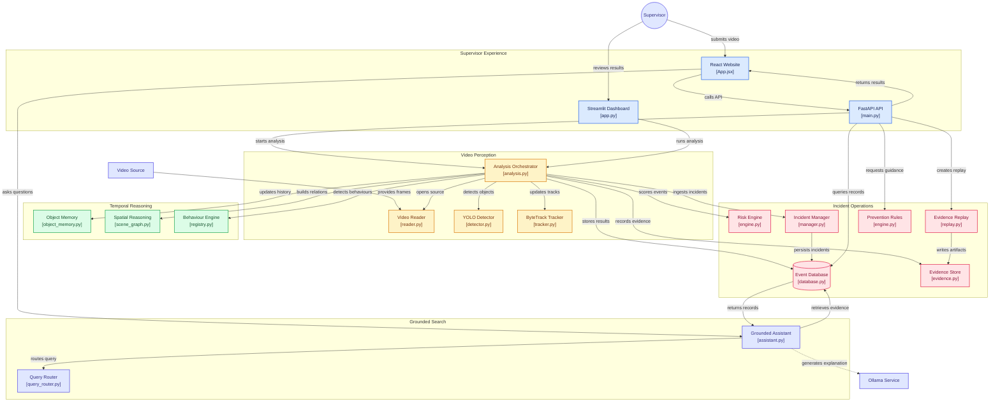

# KAVACH — Explainable Temporal Video Intelligence for Physical Operations


[](https://github.com/Vaishnavi220506/kavach-video-intelligence/actions/workflows/ci.yml)

KAVACH is a local, explainable video-intelligence prototype for warehouse and
other physical operations. It turns video into structured observations,
persistent short-term track identities, timestamped object histories,
geometry-derived relationships, temporal behaviour events, transparent risk
and incident records, evidence replay clips, and grounded natural-language
search.

The [published site](https://forklift-safety-ai.vercel.app/) is a static
bundle with no backend. It reads a committed dataset whose events, risk
scores, component breakdowns, evidence readings and prevention rules were all
produced by the real KAVACH engines from scripted trajectories; only the input
is synthetic, and detection is not part of it. Regenerate it at any time with
`python scripts/build_demo_dataset.py`, which CI checks still reproduces
byte-for-byte.

Analysing your own video needs the local runtime: OpenCV decoding, YOLO
inference, SQLite storage, and Ollama for grounded explanations. The same
build connects to the real pipeline when the FastAPI service is running, so
the site and the workspace are one application, not a mock and a product.

## What problem does it explore?

Physical operations produce long video but supervisors need short, reviewable
answers: what was observed, when did it occur, which tracked entities were
involved, why was the risk score assigned, and where is the evidence clip?

KAVACH explores a transparent architecture in which computer vision generates
structured evidence first. A local LLM may explain or search those records,
but it is not responsible for deciding what happened in the footage.

## Demo

The site has two surfaces. The **record** states what the system does, what
is measured, and what each measurement is worth, with a worked risk breakdown
taken from a real row rather than an illustration. The **workspace** keeps the
four working sections:

1. **Overview** — the reconstruction plate, what the record contains, and the
   highest scoring findings. With a local backend, upload a video or give a
   direct HTTP(S) URL and run the pipeline.
2. **Findings** — filter by behaviour, risk or signal class; open any finding
   to read its score components, measured evidence, prevention rule and review
   state. With a local backend, generate and replay short evidence clips.
3. **Ask** — grounded questions such as “show every dragging finding” or
   “which finding scored highest, and why?”. Retrieval is deterministic and
   runs first; the local model only phrases what was retrieved. Without a
   backend the site still answers the retrieval half and says plainly that no
   prose was generated.
4. **Analysis** — behaviour and risk distributions, and the entities the
   findings name.

Risk severity prints as a four-segment scale rather than relying on colour, so
a reading survives greyscale, colour-blind viewing and a monochrome printout.

## Architecture



Detailed interfaces are documented in
[`docs/ARCHITECTURE.md`](docs/ARCHITECTURE.md).

## Website

One React bundle serves both surfaces and both situations. On load it probes
`/api/health` and checks the response is genuinely the KAVACH service, because
a static host answers any unknown path with `index.html` and a 200. If the
service answers it uses the live pipeline; otherwise it falls back to the
committed dataset.

`kavach/presentation.py` is the single definition of the client-facing
evidence contract. The FastAPI service shapes its responses with it, and
`scripts/build_demo_dataset.py` generates the static fixtures with it, so the
published record and the live service cannot drift into describing the same
event differently. `tests/test_presentation.py` covers that contract and CI
regenerates the fixtures on every push to prove they still reproduce.

Capabilities the static build genuinely cannot provide — uploading, analysing,
cutting evidence clips, generating prose — are stated at the control that
would perform them rather than failing when pressed.

| Script | Purpose |
|---|---|
| `scripts/build_demo_dataset.py` | Regenerate the committed demo fixtures by running the real engines over the scripted trajectories. Deterministic. |
| `scripts/fetch_fonts.py` | Re-download the self-hosted latin subsets and regenerate `frontend/public/fonts/fonts.css`. All three families are OFL-1.1; see `frontend/public/fonts/OFL.txt`. |

Durable design decisions are recorded in [`DESIGN.md`](DESIGN.md), and the
product record future work must preserve is in [`PRODUCT.md`](PRODUCT.md).

## Implemented features

- OpenCV `VideoReader` and `VideoWriter` abstractions with source timestamps,
  metadata, frame numbering, and processed-video output.
- Ultralytics YOLO detector loaded once per cached model resource, with CPU
  fallback and standardized detections.
- Explicit ByteTrack configuration with persistent short-term IDs and
  configurable thresholds.
- Bounded timestamp-aware object memory with displacement, speed in
  pixels/second, direction, stationary duration, age, and last-seen state.
- Reusable image-space geometry, configurable named polygons, and optional
  planar homography support with documented assumptions.
- Dynamic scene graph with numeric evidence on relations such as `near`,
  `inside_zone`, `supported_by`, and `approaching`.
- Six explainable temporal safety behaviours: zone violation, possible
  dragging, possible drop, pallet overhang, unstable stack, and unsafe
  human–forklift proximity, plus general zone-transition/activity signals and
  an explainable motion-anomaly signal.
- Additional cautious temporal rules for possible throwing, possible rough
  handling, aisle obstruction, improper placement, and collision risk.
- Transparent 0–100 risk scoring with separate detection confidence,
  incident deduplication, cooldown, lifecycle, and review state.
- SQLite event storage, bounded evidence replay, evidence snapshots, and
  SHA-256 integrity verification for incident artifacts.
- Supervisor review states (`NEW`, `REVIEWED`, `FALSE_POSITIVE`) with bounded
  review history and transparent root-cause/prevention recommendations.
- Local model choice reporting and a strict per-class YOLO evaluation command.
- Local Ollama assistant with deterministic query routing/retrieval before any
  generation and actual event/timestamp/clip references in results.
- Streamlit supervisor dashboard with cached heavy resources and explicit
  analysis so chat reruns do not reanalyse video.
- Synthetic behaviour evaluation, temporal ablation, multi-video integration
  tests, and reproducible performance scripts.

## Technical design

The stable hand-off types are:

| Layer | Main interface | Output |
|---|---|---|
| Video | `VideoReader` | `FramePacket` |
| Perception | `WarehouseDetector.detect` | `Detection` |
| Tracking | `MultiObjectTracker.update` | `TrackedObject` |
| Memory | `ObjectMemory.update` | bounded `ObjectState` history |
| Spatial reasoning | `SceneGraph.update` | evidence-bearing relation edges |
| Behaviour | `BehaviourRegistry.detect` | `BehaviourEvent` |
| Risk/incident | `RiskEngine`, `IncidentManager` | scored `Incident` |
| Persistence | `EventDatabase` | SQLite rows and JSON evidence |
| Replay | `EvidenceReplay.create_clip` | short clip + metadata |
| Search | `GroundedAssistant.ask` | answer + verified references |

Risk and detection confidence are deliberately separate. Pixel distances are
not metres without camera-specific calibration. “Possible drop” is cautious
temporal evidence, not a claim of physical impact or damage.

## Installation

```bash
python -m venv .venv
# Windows PowerShell
.\.venv\Scripts\Activate.ps1
# Linux/macOS
source .venv/bin/activate
pip install -r requirements.txt
```

The validated environment used Python 3.11 on Windows. Python 3.10+ is the
intended baseline. See [`docs/REPRODUCIBILITY.md`](docs/REPRODUCIBILITY.md)
for model, Ollama, test, benchmark, and output instructions.

## Model and Ollama setup

The default detector uses the repository's `yolo11n.pt`. The optional custom
weights path is used only when present; its current checkpoint exposes
`worker` only. The website exposes a validated warehouse checkpoint slot at
`weights/kavach_warehouse.pt` and an optional YOLO-World prompt-based slot at
`weights/yolov8s-worldv2.pt` when those files exist. A model's configured class
names do not establish reliable warehouse-class accuracy. A small, optional
`person + carton` MVP checkpoint is available at
`runs/mvp/person_carton_v2_100e/weights/best.pt`; it is deliberately not the
default because its validation set is too small for a general accuracy claim.
See
[`docs/MODEL_UPGRADE.md`](docs/MODEL_UPGRADE.md),
[`docs/UPGRADE_WAREHOUSE_INTELLIGENCE.md`](docs/UPGRADE_WAREHOUSE_INTELLIGENCE.md),
and [`weights/README.md`](weights/README.md) for the data and evaluation
workflow.

For local natural-language explanations:

```bash
ollama serve
ollama pull llama3.2:3b
ollama list
```

The assistant defaults to `http://127.0.0.1:11434` and `llama3.2:3b`. Ollama
is downstream of the structured event database and does not analyze raw video.

## Usage

Start the website:

```bash
cd frontend
npm install
npm run build
cd ..
.venv/Scripts/python.exe -m uvicorn app.api.main:app --host 0.0.0.0 --port 8000
```

Open `http://localhost:8000/`.

For the original-compatible fallback:

```bash
streamlit run app/streamlit/app.py
```

The bundled sample, when present, is:

```text
data/videos/sample_warehouse.mp4
```

Example grounded questions:

```text
Show every dragging event.
Find every time a worker was close to a forklift.
Why was Event #32 considered high risk?
Which behaviour occurred most frequently?
Show incidents involving Carton #12.
What happened around 12 minutes?
Give me the timestamps worth reviewing.
Summarize this video.
```

Deterministic counts and filters are computed by SQLite retrieval first. The
LLM receives only the retrieved records, risk evidence, statistics, and
configured operational rules. If evidence is missing, the assistant reports
insufficient evidence.

## Evaluation and measured performance

The included controlled dataset has 22 synthetic structured-trajectory cases:
one positive and one negative case for each of the 11 operational behaviour
rules. The actual behaviour interfaces reproduce all designed cases: each
rule has TP=1, FP=0, FN=0, precision=1.00, recall=1.00, and F1=1.00. This is a
small rule sanity check, not real warehouse accuracy; no large labeled
real-video dataset is included. A compact, manually reviewed two-class MVP
was also trained on 15 frames (10 train / 5 validation) to exercise the full
training and error-analysis loop. The improved 100-epoch checkpoint measured
overall precision `0.886`, recall `0.578`, mAP50 `0.636`, and mAP50-95 `0.308`.
The per-class and fixed-threshold confusion results are in
[`docs/MODEL_UPGRADE.md`](docs/MODEL_UPGRADE.md). These are smoke-test values,
not general warehouse accuracy.

On the validated machine, the bundled sample metadata was 1920×1080 at 59.94
FPS, 4,548 frames, and 75.88 seconds. A bounded CPU benchmark measured:

- YOLO11n detection: 19.85 FPS average over five measured frames after one
  warmup frame.
- End-to-end KAVACH: 13.46 FPS over the first 30 source frames, taking 2.23
  seconds.
- Local Ollama `llama3.2:3b`: 8.81 seconds for one grounded summary request.
- Ollama `/api/ps`: 2,554,708,622 bytes reported model size/VRAM counters.
- Python `tracemalloc`: 111,233,651 bytes peak after the 30-frame pipeline
  prefix; this excludes native Torch/OpenCV allocation and full process RSS.

These bounded measurements do not establish real-time performance,
production readiness, or deployment-scale resource requirements. Re-run them
with the included scripts on the target machine.

See [`docs/EVALUATION.md`](docs/EVALUATION.md) and the generated JSON files in
`reports/` for details.

## Screenshots and assets

The original repository's visual assets remain in `assets/` and are retained
under the documented provenance boundary. They show the original zone-alert
prototype and should not be read as a measured KAVACH benchmark.

## Limitations and responsible AI

- The default YOLO11n/COCO model has limited warehouse-specific semantics.
- No valid local eight-class warehouse validation dataset is currently
  included. The two-class MVP is a narrow proof of concept and does not claim
  reliable package, pallet, trolley, pallet-truck, forklift, or truck support.
- Track IDs can switch under occlusion, missed detections, similar objects,
  or camera motion.
- Behaviour thresholds are image-space approximations and camera dependent.
- A monocular camera does not automatically provide metres, height, impact,
  damage, injury, or intent.
- Default dashboard zones are demonstration polygons and require camera
  configuration.
- Direct URL support means direct HTTP(S) video resources, not arbitrary
  webpages or video-platform extraction.
- The dashboard is a local supervisor prototype; live streams, authentication,
  multi-site operation, and deployment-scale monitoring are out of scope.
- Human review remains necessary. Events are evidence for review, not an
  autonomous safety or disciplinary decision.

## License and provenance

KAVACH contributions include the `kavach/` abstractions and intelligence
layers, database/replay/assistant integration, dashboard orchestration, tests,
evaluation artifacts, and project documentation.

The project is distributed under the MIT terms. The copyright and permission
notice in [`LICENSE`](LICENSE) must remain with copies and derivative works.
The technical provenance record is kept in
[`docs/KAVACH_BASELINE.md`](docs/KAVACH_BASELINE.md).

## Roadmap

The immediate next step is to expand the warehouse detector dataset in
[`docs/MODEL_UPGRADE.md`](docs/MODEL_UPGRADE.md): collect and manually label
camera-relevant videos, validate a video-separated split, retrain the
checkpoint, and report per-class metrics. Future work should be driven by that
camera-specific labeled evaluation set and false-positive analysis. Candidate improvements include better
warehouse-specific weights, calibration, occlusion handling, threshold
tuning, and deployment measurement. Broader model or infrastructure changes
should follow evidence from those evaluations.
